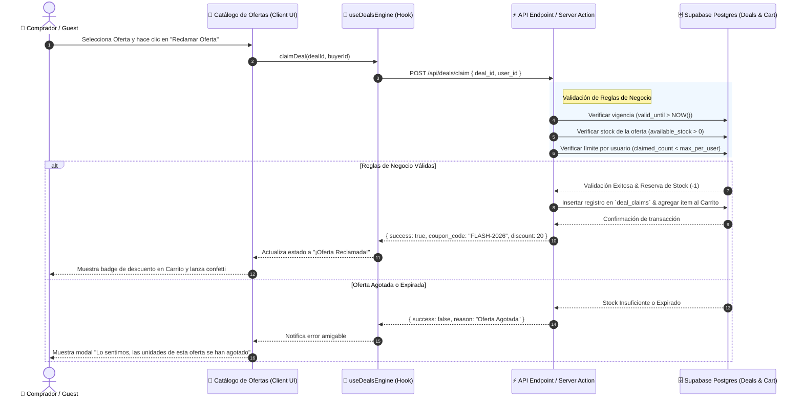
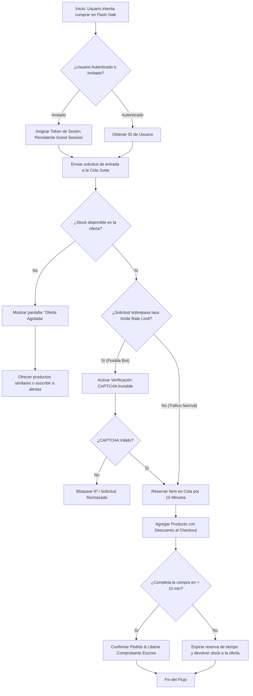
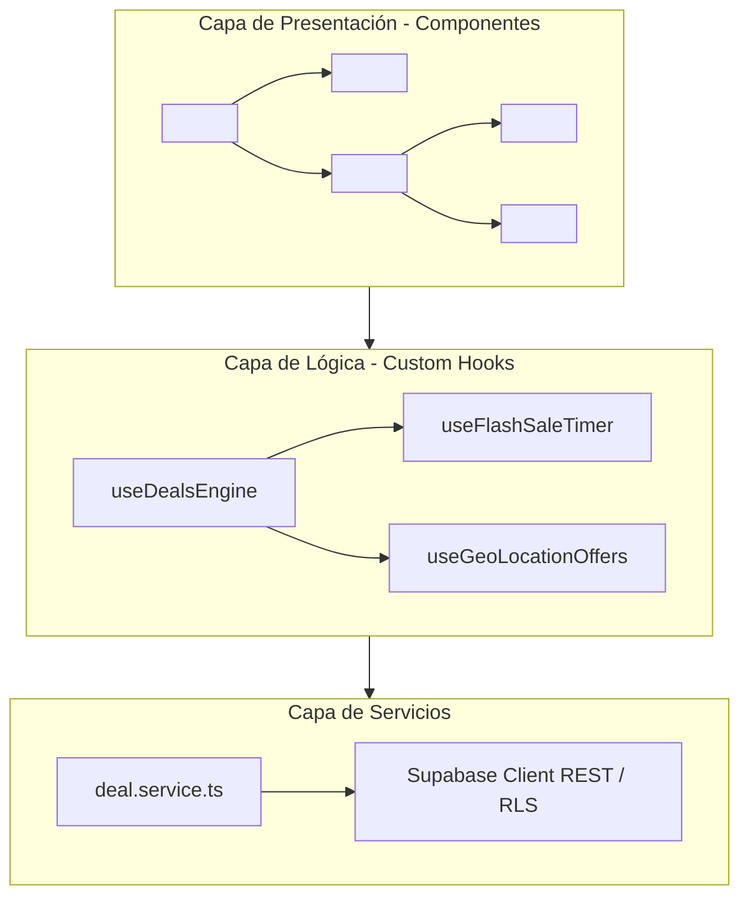

# 🔄 Diagramas de Interacción, Secuencia y Actividad: Aplicación de Ofertas

Este documento especifica el comportamiento dinámico y flujo de interacción de datos para el módulo de **Ofertas y Ventas Relámpago (*Flash Sales*)**.

---

## 1. Diagrama de Secuencia: Flujo de Reclamo y Redención de Oferta

---

## 2. Diagrama de Actividad: Control de Cola Justa Anti-Bots (Fair Queue System)

---

## 3. Arquitectura de Componentes del Motor de Ofertas

