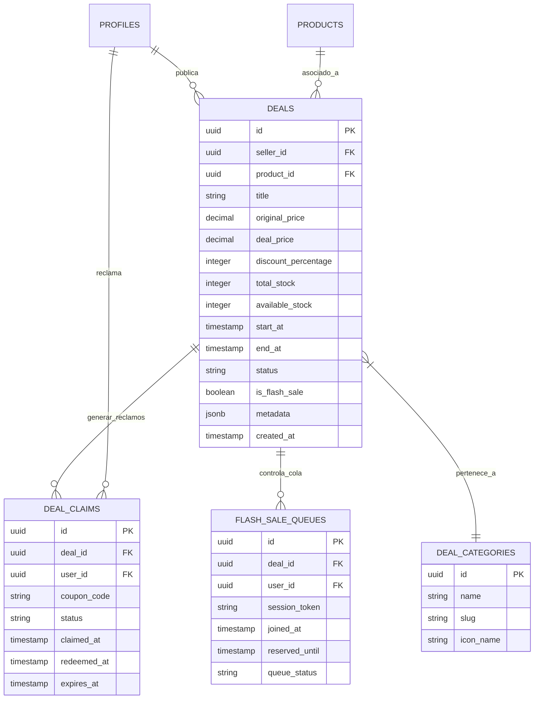

# 🗄️ Diagrama Entidad-Relación (DER): Aplicación de Ofertas & Promociones

Este documento define la estructura de datos relacional en **Supabase Postgres** para el soporte de ofertas, cupones, promociones relámpago (*Flash Sales*) y colas de reserva anti-bots.

---

## 1. Diagrama Entidad-Relación (Mermaid ER Diagram)



---

## 2. Diccionario de Datos y Especificaciones de Tablas

### 📋 Tabla: `deals` (Ofertas y Promociones)
Almacena el catálogo de promociones activas, precios con descuento, vigencia y stock exclusivo reservado para la oferta.

| Campo | Tipo de Dato | Restricciones | Descripción |
| :--- | :--- | :--- | :--- |
| `id` | `UUID` | `PRIMARY KEY, DEFAULT gen_random_uuid()` | Identificador único de la oferta. |
| `seller_id` | `UUID` | `FOREIGN KEY -> profiles(id)` | ID del vendedor o comercio creador. |
| `product_id` | `UUID` | `FOREIGN KEY -> products(id)` | Producto asociado a la promoción. |
| `title` | `VARCHAR(255)` | `NOT NULL` | Nombre comercial de la oferta. |
| `original_price` | `NUMERIC(12,2)` | `NOT NULL, > 0` | Precio habitual sin descuento. |
| `deal_price` | `NUMERIC(12,2)` | `NOT NULL, < original_price` | Precio promocional rebajado. |
| `discount_percentage` | `INTEGER` | `GENERATED ALWAYS AS (...)` | Porcentaje de descuento calculado automáticamente. |
| `total_stock` | `INTEGER` | `NOT NULL, >= 1` | Stock total asignado a la promoción. |
| `available_stock` | `INTEGER` | `NOT NULL, >= 0` | Cantidad de unidades restantes sin reclamar. |
| `start_at` | `TIMESTAMPTZ` | `NOT NULL` | Fecha y hora de inicio de la oferta. |
| `end_at` | `TIMESTAMPTZ` | `NOT NULL, > start_at` | Fecha y hora de finalización. |
| `status` | `VARCHAR(50)` | `CHECK ('active', 'expired', 'sold_out', 'paused')` | Estado actual de la promoción. |
| `is_flash_sale` | `BOOLEAN` | `DEFAULT false` | Flag para habilitar la cola rápida de Flash Sale. |

---

### 📋 Tabla: `deal_claims` (Reclamos de Oferta y Cupones)
Registra las interacciones de los usuarios al reclamar cupones de descuento.

| Campo | Tipo de Dato | Restricciones | Descripción |
| :--- | :--- | :--- | :--- |
| `id` | `UUID` | `PRIMARY KEY, DEFAULT gen_random_uuid()` | Identificador del reclamo. |
| `deal_id` | `UUID` | `FOREIGN KEY -> deals(id)` | Oferta reclamada. |
| `user_id` | `UUID` | `NULLABLE (Soporta Guest Cart)` | Usuario que reclamó el descuento. |
| `coupon_code` | `VARCHAR(50)` | `NOT NULL, UNIQUE` | Código promocional generado. |
| `status` | `VARCHAR(30)` | `CHECK ('claimed', 'redeemed', 'expired')` | Estado del cupón. |
| `claimed_at` | `TIMESTAMPTZ` | `DEFAULT NOW()` | Fecha y hora del reclamo. |
| `redeemed_at` | `TIMESTAMPTZ` | `NULLABLE` | Fecha en la que se aplicó al pagar en checkout. |
| `expires_at` | `TIMESTAMPTZ` | `NOT NULL` | Fecha límite para usar el cupón. |

---

## 🔒 Políticas de Seguridad RLS (Row Level Security)

```sql
-- 1. Cualquiera puede ver ofertas activas
CREATE POLICY "Public deals view policy" 
ON deals FOR SELECT 
USING (status = 'active' AND NOW() BETWEEN start_at AND end_at);

-- 2. Solo el vendedor dueño puede crear o modificar sus ofertas
CREATE POLICY "Seller deals management policy" 
ON deals FOR ALL 
USING (auth.uid() = seller_id);
```
