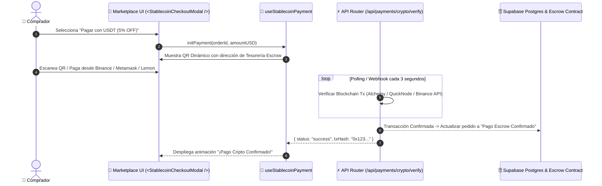

# 🇦🇷 Análisis de Pagos en Argentina (PIX vs Mercado Pago) & Guía de Implementación L2 Stablecoins

Este documento responde a las consultas sobre el sistema de pagos interoperable de Argentina, la diferencia entre transferencias P2P y botones de checkout e-commerce (Mercado Pago), y detalla la arquitectura de implementación para **L2 Stablecoins (USDT/USDC en Polygon/Solana/Base)** en la plataforma **Marketplace SaaS**.

---

## 1. 🇦🇷 ¿Existe algo parecido a PIX en Argentina?

**Sí.** En Argentina existe el sistema **Transferencias 3.0 (PCT - Pagos con Transferencia)** impulsado por el Banco Central (BCRA), operado mediante la red de interoperabilidad **CBU / CVU / Alias / QR Interoperable**.

### Comparativa: PIX (Brasil) vs. Transferencias 3.0 / PCT (Argentina)

| Característica | 🇧🇷 PIX (Brasil) | 🇦🇷 Transferencias 3.0 / PCT (Argentina) |
| :--- | :--- | :--- |
| **Operador** | Banco Central de Brasil (Directo) | Red Interoperable (COALSA / CYNCOR / Bancos / Fintechs) |
| **Costo P2P (Persona a Persona)** | **0%** | **0%** |
| **Costo P2M (Comercio / Web)** | **0.1% a 0.2%** | **0.8% tope fijado por BCRA** (vía PCT) |
| **Acreditación** | Instantánea (< 1 segundo) | Instantánea (0 a 10 segundos) |
| **Integración Web** | Nativa y universal en todo e-commerce | Integrada vía MODO / Mercado Pago / Cuenta DNI / CoFi |

---

## 2. ❓ ¿Por qué si transferir de Persona a Persona en Mercado Pago es GRATIS (0%), en una Web cobrando con Mercado Pago cobran 6%?

Esta es la trampa del modelo de negocio de las pasarelas tradicionales. La diferencia radica en **P2P (Person to Person)** vs **P2M (Person to Merchant)**:

### 🔹 Transferencia P2P (0% Comisión):
- Es un simple cambio de saldo en la base de datos interna de Mercado Pago o una transferencia bancaria CBU/CVU sin garantías comerciales.
- **Sin protección:** Si transfieres P2P y la otra persona no te envía el producto, **Mercado Pago no responde ni hay garantía**.

### 🔹 Checkout E-Commerce (6% a 7% Comisión):
Mercado Pago cobra entre 4.99% y 6.99% + IVA + Fijo por las siguientes razones:
1. **Absorción de Riesgo de Contracargos:** Mercado Pago asume el costo si el comprador usa una tarjeta clonada o desconoce la compra.
2. **Arancel de Visa / Mastercard:** Si el cliente paga con tarjeta de crédito en cuotas, las procesadoras internacionales cobran entre un 1.5% y 3.5% + impuestos retenciones (IIBB, IVA, Ganancias).
3. **Margen de Ganancia Monopólico:** Al ofrecer el botón en 1 clic y el flujo automatizado de checkout, aplican una tarifa de conveniencia comercial elevada.

> 💡 **Conclusión:** Si cobras con **Pagos con Transferencia (PCT / QR Interoperable)** el arancel baja al **0.8%**, pero las plataformas prefieren empujar el pago con tarjeta para cobrar la comisión más alta del 6%+.

---

## 3. 🚀 ¿Cómo se Implementa L2 Stablecoins (USDT/USDC) en el Marketplace SaaS?

Recomendamos **L2 Stablecoins (USDT/USDC en Polygon o Solana)** por ofrecer costo de red `< $0.001 USD` y velocidad `< 1 segundo`.

### Arquitectura de Implementación en 3 Pasos



---

### Code Blueprint: Custom Hook `useStablecoinPayment.ts`

```typescript
// src/features/payments/hooks/useStablecoinPayment.ts
import { useState, useEffect } from 'react';

export function useStablecoinPayment(amountUSD: number) {
  const [usdtRate, setUsdtRate] = useState<number>(1);
  const [qrCodeUrl, setQrCodeUrl] = useState<string>('');
  const [isVerifying, setIsVerifying] = useState(false);
  const [isPaid, setIsPaid] = useState(false);

  // Dirección de Tesorería Escrow de la Plataforma (Red Polygon / Solana)
  const escrowWalletAddress = "0x71C7656EC7ab88b098defB751B7401B5f6d8976F";

  useEffect(() => {
    // Generar URI de pago estándar EIP-681 / Solana Pay
    const paymentUri = `ethereum:${escrowWalletAddress}@137/transfer?address=${escrowWalletAddress}&uint256=${amountUSD * 1e6}`;
    setQrCodeUrl(`https://api.qrserver.com/v1/create-qr-code/?size=200x200&data=${encodeURIComponent(paymentUri)}`);
  }, [amountUSD]);

  const verifyPayment = async (txHash?: string) => {
    setIsVerifying(true);
    // Simulación de verificación en la Blockchain (Alchemy / RPC)
    setTimeout(() => {
      setIsVerifying(false);
      setIsPaid(true);
    }, 2000);
  };

  return {
    escrowWalletAddress,
    amountUSDT: amountUSD,
    qrCodeUrl,
    isVerifying,
    isPaid,
    verifyPayment,
  };
}
```
