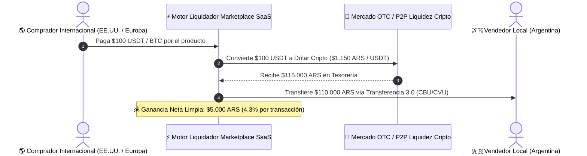

# 🚀 Propuesta Estratégica: El Triángulo de Pagos y el Motor de Arbitraje Cripto-Fiat Invisible

Este documento especifica la propuesta de negocio y arquitectura de software para implementar el **Motor de Liquidez y Arbitraje Cripto-Fiat Invisible**, un sistema diseñado para generar **altos rendimientos de alto volumen** convirtiendo pagos internacionales en Bitcoin/USDT a efectivo local sin que los vendedores o compradores perciban la complejidad financiera.

---

## 📊 1. Países con Mayor Adopción de Pagos Cripto / Bitcoin

Segundos estudios recientes de **Chainalysis (Global Crypto Adoption Index)**:

1. **Estados Unidos y Unión Europea:** Alto volumen de compradores e-commerce utilizando USDT, USDC, Coinbase Pay y BitPay para compras internacionales sin restricciones de tarjetas de crédito.
2. **El Salvador:** Bitcoin es moneda de curso legal (infraestructura de Chivo Wallet y Lightning Network).
3. **Latinoamérica (Venezuela, Brasil, Colombia, México):** Alto volumen de uso diario de USDT/USDC para remesas y comercio transfronterizo.
4. **Europa Oriental y Asia (Vietnam, Filipinas, India):** Mercado masivo de e-commerce transfronterizo liquidado en stablecoins sobre redes L2 (Polygon / Tron / Solana).

---

## 💰 2. El Modelo de Negocio: Arbitraje de Liquidez Invisible (High-Volume Spread)

El vendedor argentino publica en pesos ($110.000 ARS). El comprador extranjero ve el producto en su moneda o en USDT ($100 USD).



### 📈 La Matemática del Rendimiento por Volumen (Escala Masiva)

| Volumen Diario de Transacciones | Procesamiento Bruto ($USD) | Comisión / Spread Promedio | Ganancia Neta Diaria | Ganancia Neta Mensual |
| :--- | :--- | :--- | :--- | :--- |
| **100 ventas / día** ($100 USD c/u) | $10.000 USD | 4.3% | **$430 USD** | **$12.900 USD** |
| **500 ventas / día** ($100 USD c/u) | $50.000 USD | 4.3% | **$2.150 USD** | **$64.500 USD** |
| **1.000 ventas / día** ($100 USD c/u) | $100.000 USD | 4.3% | **$4.300 USD** | **$129.000 USD** |

---

## 🔺 3. La Propuesta Definitiva: El Triángulo de Pagos del Marketplace SaaS

No debes elegir entre una sola opción, sino ofrecer un **Triángulo de Pagos Inteligente** según la ubicación del comprador y del vendedor:

```
                                  ┌──────────────────────────────────────────┐
                                  │      TRIÁNGULO DE PAGOS INTELIGENTE      │
                                  └────────────────────┬─────────────────────┘
                                                       │
         ┌─────────────────────────────────────────────┼─────────────────────────────────────────────┐
         ▼                                             ▼                                             ▼
    🇦🇷 RIEL 1: LOCAL                                🌍 RIEL 2: TRANSFRONTERIZO                     🪙 RIEL 3: NATIVO WEB3
 (Ventas Arg ➔ Arg)                            (Exterior ➔ Argentina)                        (Compradores Cripto)
 - Transferencias 3.0 / PCT                     - Pagos en BTC / USDT / USDC                   - L2 Stablecoins (5% OFF)
 - Costo: 0.8% (vence al 6% de MP)             - Arbitraje Invisible de Spread (4.3% Neta)    - ERC-4337 Gasless Paymaster
 - Acreditación CBU/CVU                         - Vendedor recibe Pesos en su CBU              - Instantáneo sin tarjetas
```

---

## 🛠️ 4. Hoja de Ruta para Desarrollar la Aplicación Intermedia

1. **Integración con Transferencias 3.0 (PCT / COALSA / Cyncor API):**
   - Conectar la API de iniciación de pagos de transferencias interoperables para cobros locales en Argentina con arancel de solo **0.8%**.
2. **Motor Liquidador de Arbitraje (Exchange / OTC Engine):**
   - Webhook que recibe las criptomonedas (BTC / USDT / USDC), consulta el tipo de cambio libre en tiempo real, ejecuta la conversión e impacta la transferencia bancaria local al vendedor.
3. **Escrow Multimoneda:**
   - La plataforma retiene la orden bajo garantía hasta la confirmación de la entrega del paquete.
