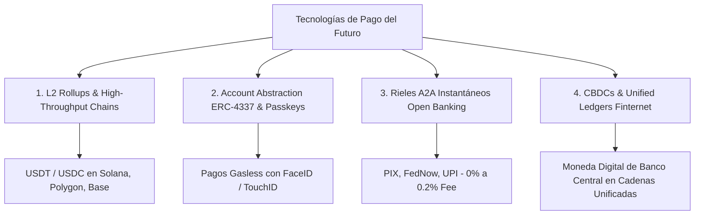

# 🔬 Investigación Técnica: Tecnologías de Pago del Futuro de Ultra-Bajo Costo y Sin Intermediarios (Post-Bitcoin)

Basado en investigaciones recientes del **BIS (Bank for International Settlements)**, el **MIT Digital Currency Initiative**, el **IMF** y papers de **IEEE / ACM**, se analiza el panorama de los pagos digitales de próxima generación diseñados para eliminar las comisiones del 3% al 7% de las redes tradicionales (Visa, Mastercard, Swift).

---

## 📊 1. Diagnóstico de Limitaciones de Bitcoin para Comercio Diario

| Propiedad | ₿ Bitcoin (L1) | 🚀 Requisito E-commerce Moderno |
| :--- | :--- | :--- |
| **Tiempo de Confirmación** | 10 a 60 minutos | `< 2 segundos` |
| **Costo por Transacción** | $1.50 a $25.00 USD (Volátil) | `< $0.005 USD` |
| **Capacidad de Procesamiento** | 7 transacciones / segundo | `> 50,000 TPS` |
| **Estabilidad de Valor** | Alta volatilidad (Riesgo cambiarial) | Paridad 1:1 con moneda fiat (Stablecoins) |

---

## ⚡ 2. Las 4 Tecnologías de Pago del Futuro Identificadas en la Literatura Académica

### 1️⃣ Redes de Capa 2 (L2 Rollups / ZK-Proofs) + Stablecoins Fiat-Backed
* **Paper de Referencia:** *BIS Working Papers: "Programmable money and the future of payments"*
* **Concepto:** Bitcoin es una reserva de valor (oro digital), pero **las transacciones comerciales diarias del futuro ocurren sobre Capas 2 (ZK-Rollups y L2s) utilizando Stablecoins (USDC / USDT / PYUSD)** sobre redes como Solana, Polygon PoS o Base.
* **Costo por Transacción:** **<$0.001 USD** (Menos de un décimo de centavo).
* **Finalidad:** Confirmación irreversible en **400 a 800 milisegundos**.

---

### 2️⃣ Abstracción de Cuentas (ERC-4337) & Pagos "Gasless" (Passkeys / Biometría)
* **Paper de Referencia:** *ACM International Conference on Financial Cryptography: "Account Abstraction: Usability vs Security"*
* **Concepto:** Elimina la mayor fricción de las criptomonedas: las frases semilla y la necesidad de tener ether/solana para pagar gas.
* **Cómo Funciona en el Marketplace:**
  - El usuario paga usando su **FaceID o huella dactilar** (Autenticación WebAuthn / Passkeys).
  - El Marketplace o la pasarela actúa como un contrato **Paymaster** que subsidia la fracción de centavo del costo de red.
  - El comprador paga el monto exacto del producto ($10 USD) en stablecoin **sin comisiones de gas**.

---

### 3️⃣ Rieles Directos Banco-a-Banco Account-to-Account (A2A) & Open Banking
* **Paper de Referencia:** *IMF Staff Discussion Note: "The Evolution of Public Payment Systems"*
* **Concepto:** Sistemas de liquidación instantánea estatal/públicos sin intermediarios privados de tarjetas.
* **Casos de Éxito Globales:**
  - **PIX (Brasil):** 0% comisión para personas, 0.1% para comercios. Liquidación en 1 segundo 24/7.
  - **UPI (India):** Más de 10,000 millones de transacciones mensuales con costo 0% para micro-comercios.
  - **FedNow / CoFi / SEPA Instant:** Transferencias directas CBU-a-CBU mediante APIs seguras de Open Banking.

---

### 4️⃣ El "Finternet" y Cadenas Unificadas de CBDC (Visión del BIS y Bancos Centrales)
* **Paper de Referencia:** *Agustín Carstens / BIS Special Report: "The Finternet: the future architecture for the financial system"*
* **Concepto:** Integración de dinero tokenizado emitido por bancos centrales (CBDCs) con activos comerciales en un libro mayor unificado (*Unified Ledger*).
* **Ventaja:** Elimina la necesidad de bancos adquirentes, pasarelas de pago intermediarias y periodos de acreditación de 48 horas.

---

## 🏛️ Comparativa de Costos Operativos por Tecnologías

| Arquitectura de Pago | Comisión de Pasarela | Costo Fijo por Transacción | Tiempo de Acreditación | Fricción para el Cliente |
| :--- | :--- | :--- | :--- | :--- |
| **Visa / Mastercard / Mercado Pago** | 3.5% a 6.5% | $0.30 - $0.50 USD | 1 a 14 días | Baja (Muy extendido) |
| **Bitcoin L1** | 0% | $2.00 - $15.00 USD | 10 a 60 min | Alta (Volátil + Lento) |
| **Open Banking A2A (PIX / FedNow)** | 0% a 0.2% | $0.00 USD | Instantáneo (1s) | **Nula** (Nativo en banco) |
| **L2 Stablecoins + ERC-4337 (Solana/Polygon)** | **0%** | **< $0.001 USD** | **Instantáneo (< 1s)** | **Baja (Autenticación FaceID)** |
