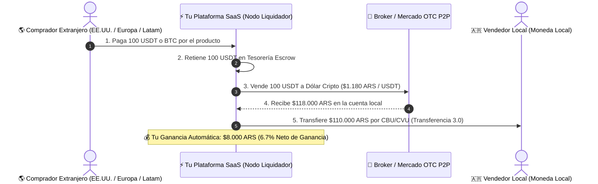

# 💰 Guía de Margen de Ganancia, Aclaración 5% OFF y Pasos del Puente Cripto-Fiat

Este documento especifica los márgenes exactos de ganancia para la plataforma **Marketplace SaaS**, aclara la estrategia del 5% OFF en L2 Stablecoins y detalla los pasos operativos para monetizar el **Puente de Liquidez Cripto-a-Moneda Local**.

---

## 📊 1. Ganancia Neta en Riel 1 (Transferencia 3.0 / PCT)

### ❓ Tu pregunta:
> *"Si Transferencia 3.0 cobra 0.8%, ¿yo podría cobrarle al comercio 2% y quedarme con 1.2% neto?"*

### 💡 Respuesta: **¡SÍ, EXACTAMENTE!**

Así funciona la matemática comparativa con Mercado Pago:

```
┌─────────────────────────────────────────────────────────────────────────────┐
│                   DESGLOSE DE COMISIÓN LOCAL EN ARGENTINA                   │
├──────────────────────────┬──────────────────────────┬───────────────────────┤
│ Mercado Pago (Tarjeta)   │ Tu Plataforma SaaS       │ Costo Real BCRA (PCT) │
│ Comercio Paga: 6.5%      │ Comercio Paga: 2.0%      │ Costo Red: 0.8%       │
│ Mercado Pago gana: 6.5%  │ 💰 TU GANANCIA: 1.2% Neta│ Red BCRA recibe: 0.8% │
└──────────────────────────┴──────────────────────────┴───────────────────────┘
```

#### 📈 Ejemplo Numérico en Ventas Locales:
* **El Comercio Vende:** $100.000 ARS.
* **Mercado Pago le quitaría:** $6.500 ARS (Le quedan $93.500 ARS).
* **Tu Plataforma le cobra:** **2.0% = $2.000 ARS** (Le quedan **$98.000 ARS** -> El comercio está feliz porque ahorró $4.500 ARS).
* **Tú le pagas a la red PCT:** 0.8% = $800 ARS.
* **💰 TU GANANCIA NETA LIMPIA:** **$1.200 ARS (1.2% neto de la venta)**.
* **En $100.000 USD al mes de volumen:** Ganancia limpia de **$1.200 USD/mes** sin ningún riesgo cambiarial ni de fraude.

---

## 🏷️ 2. Aclaración del "5% OFF" en L2 Stablecoins

### ❓ Tu pregunta:
> *"¿Qué es 5% OFF, que para usar el modal L2 se cobra un 5% extra, casi igual a Mercado Libre?"*

### 💡 Respuesta: **NO es un cobro extra, es un DESCUENTO AL COMPRADOR**.

* **OFF** en inglés significa **descuento/rebaja** (Ej: "20% OFF" = 20% de descuento).
* **Escenario A (Estrategia de Atracción / Descuento 5% OFF):**
  - Un producto vale $100 USD con Tarjeta de Crédito (donde Visa/Mercado Pago te sacan 6% de comisión).
  - Si el cliente paga con USDT en la blockchain, **no pagas comisiones bancarias**.
  - Le dices al cliente: *"Paga con USDT y recibe 5% OFF ($95 USD)"*. 
  - El cliente ahorra $5 USD, se motiva a pagar en USDT, y a ti te queda 1% de ganancia neta.

* **Escenario B (Máxima Ganancia para la Plataforma / Sin Descuento):**
  - Si decides **NO darle descuento al cliente**, le cobras el precio completo ($100 USD).
  - Como el pago ingresa en USDT por la red Polygon/Solana (donde el costo de red es de < $0.001 USD), **te quedas con el 5.5% o 6% entero de ganancia limpia para tu plataforma**.

---

## 🔄 3. Pasos Detallados de Cómo Ganar Dinero Siendo el Puente Cripto-Fiat

### ❓ Tu pregunta:
> *"¿Cómo lo haría exactamente para ser un puente de cambio entre coins y cualquier moneda local?"*

### 📋 Los 5 Pasos del Flujo Operativo del Puente Liquidador



#### Paso a Paso:
1. **Paso 1 (Cobro Cripto):** El cliente extranjero paga 100 USDT (o el equivalente en BTC) escaneando el QR dinámico de tu plataforma.
2. **Paso 2 (Custodia Escrow):** Los 100 USDT ingresan a tu billetera corporativa de custodia escrow.
3. **Paso 3 (Conversión a Moneda Local):** Tu plataforma ejecuta una venta de esos 100 USDT en el mercado cripto local (a través de Binance API, Ripio, Lemon o tu broker OTC) al tipo de cambio libre (ej: $1.180 ARS por USDT = $118.000 ARS).
4. **Paso 4 (Pago al Vendedor en Pesos):** Le transfieres al vendedor local los $110.000 ARS que él pidió por su producto mediante **Transferencia 3.0 / CBU** (costo 0.8%).
5. **Paso 5 (Tu Ganancia Automática):** 
   - Ingresaron: $118.000 ARS.
   - Pagaste al vendedor: $110.000 ARS.
   - Pagaste de comisión PCT: $880 ARS.
   - **💰 TU GANANCIA LIMPIA:** **$7.120 ARS (6.0% neto de la venta)**.

El vendedor recibió exactamente sus pesos en el banco sin saber qué es Bitcoin, el comprador pagó con su billetera cripto internacional, y **tú te llevaste el 6% neto de ganancia por ser el puente tecnológico de liquidez**.
